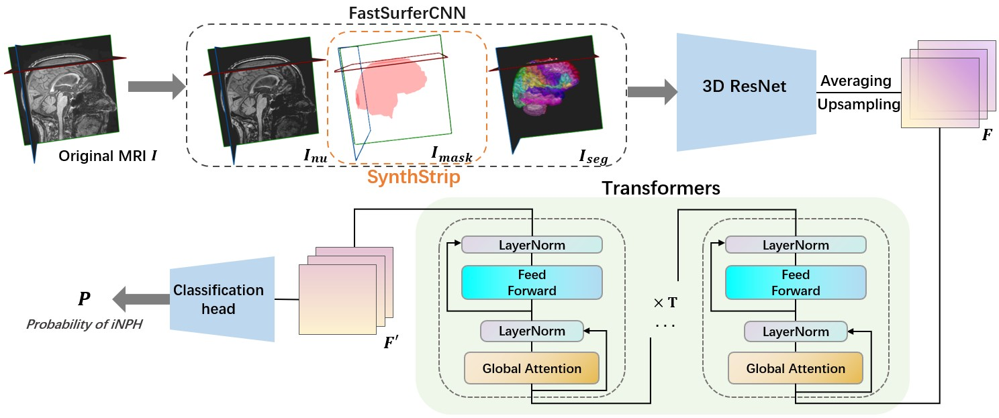

# iNPH-ResViT(TBA)
Official Implement of paper 'XXXX'

[link_TBA](https:test) 



Installing or updating the dependencies:

```
pip install --requirement utils/requirements.txt
```

## Preprocess
1. Input the 3D brain MRI data into [FastSurfer(--seg_only)](https://github.com/deep-mi/FastSurfer) for data preprocessing. 
2. Run [SynthStrip](https://surfer.nmr.mgh.harvard.edu/docs/synthstrip/#tool) to get the mask of orig_nu.mgz (One of [FastSurfer output files](https://github.com/Deep-MI/FastSurfer/blob/dev/doc/overview/OUTPUT_FILES.md)).
3. Change the path or name as needed in 'data/mgz2nii_FF.py' and run it to generate the dataset for the model.


The dataset format generated according to the above method should be as follows(The test set and validation set follow a similar format):
```
Training Dataset:
----case name1
--------aparc.DKTatlas+aseg.deep.nii.gz  # (Segmentation result of FastSurfer)
--------orig_nu.nii.gz                   # (biasfield-corrected image of FastSurfer)
--------SS_mask.nii.gz                   # (SynthStrip mask of orig_nu.nii.gz)
----case name2
--------aparc.DKTatlas+aseg.deep.nii.gz
--------orig_nu.nii.gz
--------SS_mask.nii.gz
......
```
***

## Train
1. Change the dataset path and model parameters as needed in 'config.py'.
2. Selecting model and run 'train.py'.
3. Wait patiently and happily for the program to finish.
4. Then you will get a good iNPH model!


## Test
1. Similarly, generate the test dataset following the above process.
2. Change the path to where your data and models are located in 'test.py'.
3. Run 'test.py'.


## XAI
We also provide example code 'Xai.py' for implementing eXplainable AI (XAI). 
1. Change the parameters such as the model's path, dataset's path, etc. 
2. Choose whether to visualize or save the heatmap(as nii.gz files)
3. Run 'Xai.py'.

## Citation
If you use this code for your research, please cite our paper:

```
TBA
```
